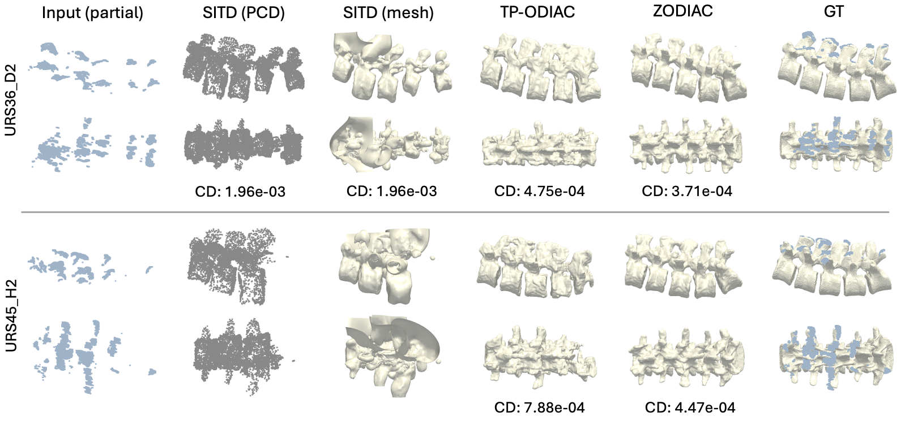
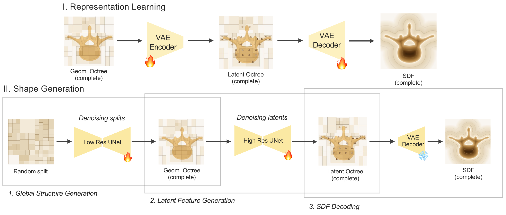
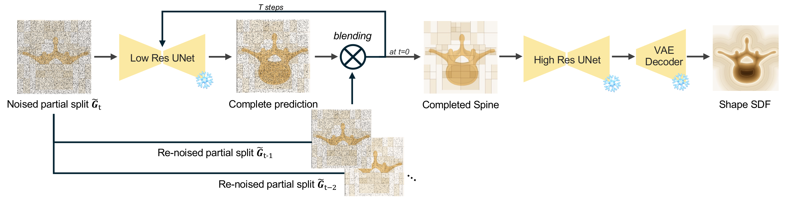

# ZODIAC

### Zero-shot Octree-based Diffusion for Anatomical Completion

Miruna-Alexandra Gafencu<sup>1,2,3,\*</sup>, Vlad Bratulescu<sup>1,\*</sup>, Yordanka Velikova<sup>1,2</sup>, Mohammad Farid Azampour<sup>1,2</sup>, Nassir Navab<sup>1,2</sup>

<sup>1</sup> Chair for Computer Aided Medical Procedures (CAMP), Technical University of Munich &nbsp;
<sup>2</sup> Munich Center for Machine Learning (MCML) &nbsp;
<sup>3</sup> Konrad Zuse School of Excellence in Reliable AI (relAI)

\* the authors contributed equally

**ShapeMI @ MICCAI 2026** &nbsp;|&nbsp; [Paper](http://arxiv.org/abs/2608.24422)



This repository publishes the code of the Paper Zero-shot Octree-based Diffusion for Anatomical Completion accepted at ShapeMI @ MICCAI 2026. 

---

## Method overview

Recovering the full 3D spine anatomy from intraoperative ultrasound (US) is an ill-posed
inverse problem: bone strongly reflects US and casts deep acoustic shadows, so only part
of the spine is ever visible, and expert annotations of the visible surface are noisy.
Existing supervised US shape-completion methods learn from synthetically generated
incomplete–complete pairs under a *predefined* corruption distribution, which does not
match real intraoperative occlusions and limits generalisation.

**ZODIAC** reconstructs the entire lumbar spine from partial US observations **without
paired training data**. It learns a generative diffusion prior over *complete* anatomies
in an adaptive **octree** representation.



At inference it performs **blended completion**:
the partial observation is blended into each reverse-diffusion step, so the prior
completes the unobserved (shadowed) regions while the observation constrains the visible
structure. Because the partial is only used at test time, the method generalises to
previously unseen patterns of missing structure.





**Headline results** ZODIAC outperforms the current state-of-the-art shape completion method [[1]](#references). ZODIAC matches the supervised TP-ODIAC under standard
conditions and outperforms it by up to **22% on HD95** when the partial observation
contains unexpected missing regions (difficult cases), while producing far more
consistent completions across subjects. ZODIAC does not use **any paired training data**.

This repository releases the method code, configs, and scripts to train and run:
- **ZODIAC** — zero-shot completion via blended (re-noised) partial conditioning.
- **ZODIAC-clean** — ablation that pins the *clean* partial as a hard constraint at every step.
- **TP-ODIAC** — the supervised, trained-with-pairs variant (upper-bound reference).

---

## Repository layout

```
ZODIAC/
├── train.py                     # single entry point (train / generate), all stages & variants
├── builder.py
├── models/                      # octree VAE + two-stage diffusion (incl. blended completion
│   └── octfusion_model_union.py #   use_partial_pcd_zero_shot / _clean / _condition flags
├── datasets/                    # octree/SDF dataloaders
├── options/                     # CLI options
├── solver/                      # training loop helpers
├── utils/                       # octree utils, visualisation
├── configs/                     # OmegaConf configs (see below)
│   ├── training_ZODIAC/         # ZODIAC / ZODIAC-clean prior — VAE + diffusion architecture
│   └── inference/              # inference configs: zodiac / zodiac_clean / tpodiac (+ balgrist/phantom data)
├── scripts/                     # launch scripts (see Training / Inference)
│   ├── training_ZODIAC/         # train_vae.sh, train_uncond_lr.sh, train_uncond_hr.sh
│   ├── inference_ZODIAC/        # run_multiseed.sh, run_singleseed.sh
│   ├── inference_ZODIAC_clean/  # run_multiseed.sh, run_singleseed.sh
│   └── inference_TPODIAC/       # run_multiseed.sh, run_singleseed.sh
├── tools/                       # preprocess_from_mesh.py (mesh → SDF → octree dataset) + helpers
└── evaluation/                  # Table-1 evaluation (CD / F1 / HD95, WS + VW)
```

---

## Installation

```bash
# 1. Clone
git clone https://github.com/miruna20/ZODIAC.git
cd ZODIAC

# 2. Create the conda environment
conda create -n octfusion python=3.9 -y && conda activate octfusion

# 3. Install PyTorch (CUDA 12.1)
conda install pytorch torchvision torchaudio pytorch-cuda=12.1 -c pytorch -c nvidia

# 4. Install the remaining Python dependencies
pip3 install -r requirements.txt
```

---

## Data & pretrained models

We provide the prepared datasets and trained checkpoints on LRZ Sync+Share:

- **Data:** https://syncandshare.lrz.de/getlink/fiK577UYP9iYWQiLwm5hBh/
- **Checkpoints:** https://syncandshare.lrz.de/getlink/fiWdgq64ZePMA6GVaXvzJ6/

Download both archives and unzip them into the repo root so that:

- the **data** is extracted into `data/` (see [`data/README.md`](data/README.md) for the
  contents and per-dataset layout), and
- the **checkpoints** are extracted into `checkpoints/`.

The resulting (repo-relative) layout expected by the scripts is:

```
ZODIAC/
├── data/           # prepared octree datasets (see data/README.md)
└── checkpoints/    # trained VAE + diffusion checkpoints
```

### Pretrained checkpoints

| Variant | Diffusion (HR) checkpoint | VAE checkpoint |
|---|---|---|
| **ZODIAC** / **ZODIAC-clean** | `checkpoints/zodiac/diffusion/df_steps-latest.pth` | `checkpoints/zodiac/vae/vae_steps-latest.pth` |
| **TP-ODIAC** | `checkpoints/tp-odiac/diffusion/df_steps-latest.pth` | `checkpoints/tp-odiac/vae/vae_steps-latest.pth` |


### Datasets used in the paper

- **Training (complete shapes only):** 91 VerSe20 lumbar spines with deformation
  augmentation (2 deformations each → **182**) + **322** TotalSegmentator lumbar spines =
  **504** complete spines.
- **Evaluation (test only):** 2 anthropomorphic lumbar-spine **phantoms** and **6**
  volunteer scans from the **Balgrist** dataset (paired US–CT) [[3]](#references).

Public sources: [VerSe20](https://github.com/anjany/verse),
[TotalSegmentator](https://github.com/wasserth/TotalSegmentator),
Balgrist dataset and phantoms [[3]](#references).

---

## Data layout and pre-processing


```
data/<dataset>/
├── dataset_256/<sample>/{pointcloud.npz, sdf.npz, partial.npz, points.npz}   # per-sample set varies by dataset
├── bbox_256/<sample>.npz
├── sdf_256/<sample>.npy
├── mesh_256/<sample>.obj            # whole-spine GT mesh (+ <sample>_partial.ply)
├── mesh_vertebrae_256/<sample>/     # per-vertebra GT meshes (for vertebra-wise eval)
└── filelist/{train,test,validation,all}.txt
```

The exact per-sample file set and the per-dataset split counts are documented in
[`data/README.md`](data/README.md) (e.g. training samples carry `pointcloud.npz` + `sdf.npz`,
while the test sets add `partial.npz`; `mesh_*`/`bbox_256` exist only for the test sets).


Build the dataset from meshes (Optional):

> **Skip this if you downloaded the released data**, since it is already in the
> `dataset_256` format ready to use. This section is only for preparing a **new**
> dataset from your own raw meshes.

For preprocessing your own data starting from meshes check tools/preprocess_from_mesh.py

## Training

ZODIAC is trained in three stages (VAE → LR diffusion → HR diffusion). Paper setup: 256³ SDF; VAE 900 epochs
(AdamW, lr 1e-3, KL weight 0.1); LR 1500 epochs and HR 300 epochs (AdamW, lr 2e-4, batch
size 1, EMA 0.999); 504 complete spines on a single NVIDIA RTX 4080.

Run from the repo root (with the data unzipped into `data/`):

```bash
conda activate octfusion
bash scripts/training_ZODIAC/train_vae.sh         # Stage 1: VAE
bash scripts/training_ZODIAC/train_uncond_lr.sh   # Stage 2: LR diffusion (from scratch)
bash scripts/training_ZODIAC/train_uncond_hr.sh   # Stage 3: HR diffusion (pre-trains from the LR checkpoint)
```

Each script takes an optional GPU id (defaults to 0), e.g. `bash scripts/training_ZODIAC/train_vae.sh 1`.

`train_vae.sh` starts a fresh, **timestamped run** and records it, so the two diffusion
stages attach to the same run automatically (in order). Everything for one training lands
under a single run directory (all gitignored):

```
logs/training_ZODIAC_<timestamp>/
├── vae/ckpt/vae_steps-latest.pth            # Stage 1
├── diffusion-lr/ckpt/df_steps-latest.pth    # Stage 2 (reads the Stage-1 VAE)
└── diffusion-hr/ckpt/df_steps-latest.pth    # Stage 3 (pre-trains from the Stage-2 LR ckpt)
```

Run the three stages in order. The full hyperparameters for each run are saved in `logs/<run>/<stage>/opt.txt`
and the configs copied alongside.

---

## Inference (Shape Completion)

Completion runs on the phantom and Balgrist test sets, using the
released checkpoints in `checkpoints/`. The three variants differ only by the diffusion
config flag (all consume the same partial point clouds from `partial.npz`):

| Variant | Checkpoints | Config | Flag |
|---|---|---|---|
| **ZODIAC** (zero-shot, blended) | `checkpoints/zodiac/` | `configs/inference/octfusion_zodiac.yaml` | `use_partial_pcd_zero_shot` |
| **ZODIAC-clean** (hard-constraint ablation) | `checkpoints/zodiac/` | `configs/inference/octfusion_zodiac_clean.yaml` | `use_partial_pcd_zero_shot_clean` |
| **TP-ODIAC** (supervised) | `checkpoints/tp-odiac/` | `configs/inference/octfusion_tpodiac.yaml` | `use_partial_pcd_condition` |

Each variant has its own folder under `scripts/`, with a `run_multiseed.sh` (paper
reproduction) and a `run_singleseed.sh` (quick run); both take an optional GPU id.

**Multi-seed (paper reproduction)** — 10 seeds (42–51) over both test sets, then reorganised
per scan for the mean ± std reporting:

```bash
conda activate octfusion
bash scripts/inference_ZODIAC/run_multiseed.sh         [GPU_ID]   # ZODIAC
bash scripts/inference_ZODIAC_clean/run_multiseed.sh   [GPU_ID]   # ZODIAC-clean
bash scripts/inference_TPODIAC/run_multiseed.sh        [GPU_ID]   # TP-ODIAC
```

Meshes are written to `results/inference/<variant>/<dataset>/seed_<n>/completion/<scan>.obj`
and then copied per scan to `results/inference/<variant>/<dataset>/<scan>/seed_<n>.obj`
(both `results/` — gitignored). Override the output root with
`RESULTS_OUT=/path bash scripts/inference_ZODIAC/run_multiseed.sh`.

**Single-seed quick run** (seed 42, both test sets, no seed loop) — writes the raw
completions to `results/inference/<variant>/<dataset>/completion/<scan>.obj` and then
copies them per scan to `results/inference/<variant>/<dataset>/<scan>/seed_42.obj`, the
same layout as multi-seed, so a single-seed run can be evaluated directly with
`--num_seeds 1`:

```bash
bash scripts/inference_ZODIAC/run_singleseed.sh        [GPU_ID]   # ZODIAC
bash scripts/inference_ZODIAC_clean/run_singleseed.sh  [GPU_ID]   # ZODIAC-clean
bash scripts/inference_TPODIAC/run_singleseed.sh       [GPU_ID]   # TP-ODIAC
``` 


## Evaluation 
The script `evaluation/evaluate.py` computes Chamfer Distance (CD),
F1, and 95% Hausdorff distance (HD95) at both **whole-spine (WS)** and **vertebra-wise
(VW, L1–L5)** levels, aggregated as mean ± std over default 10 seeds (the same way we obtained the results for the paper). It is, however possible to manually set the number of seeds.  See
[`evaluation/README.md`](evaluation/README.md) for the full reference.

**Prerequisites**

1. `conda activate octfusion` (evaluation is pure numpy / scipy / trimesh).
2. **Data** under `data/` (from LRZ, see [`data/README.md`](data/README.md)). Per test set
   `spines_<ds>` (`ds` = `phantoms` | `balgrist`), evaluation reads `mesh_256/<scan>.obj`
   (WS GT), `bbox_256/<scan>.npz` (mm scale for HD95), and — for VW —
   `mesh_vertebrae_256/<scan>/{L1..L5}.obj` (per-vertebra GT).
3. **Predictions** under `results/inference/` in the per-scan layout
   `<method>/<dataset>/<scan>/seed_<n>.obj`, i.e. run inference first (the `run_multiseed.sh`
   scripts above for the full 10-seed table, or `run_singleseed.sh` for a quick `--num_seeds 1`
   check).

**Run** (from the repository root):

```bash
python evaluation/evaluate.py                              # 10 seeds, all methods present
python evaluation/evaluate.py --num_seeds 1                # quick single-seed check
python evaluation/evaluate.py --methods zodiac zodiac_clean  # evaluate a subset
```

This writes `evaluation/results/table.csv` (columns
`dataset, method, level, cd, cd_std, f1, f1_std, hd95mm, hd95mm_std`; CD ×1e4, HD95 in mm)
and prints a compact summary over the three groups **Phantom**, **Balgrist_all** (6 subjects),
and **Balgrist_difficult** (URS36_D2, URS45_H2, URS45_R2).

**You don't need to have run inference for every method.** `evaluate.py` first reports which
methods have predictions on disk and which are missing, then evaluates only the available ones
— so you can, e.g., evaluate ZODIAC and ZODIAC-clean before TP-ODIAC inference has been run:

## Results
On the same datasets from antropomorphic phantom and volunteer data we compare ZODIAC against SITD[[1]](#references) (a prior vertebra-wise shape completion network), TP-ODIAC (the supervised variant of ZODIAC) and ZODIAC-clean (ablation of the re-noising process of the observation during inference). 


| Domain | Eval | Method | CD↓ | F1↑ | HD95↓ |
|---|---|---|---|---|---|
| Phantom | WS | SITD *(sup.)* | 5.38 ± 0.86 | 0.362 ± 0.029 | 7.53 ± 0.75 |
| Phantom | WS | TP-ODIAC *(sup.)* | 4.23 ± 1.61 | 0.411 ± 0.103 | 6.11 ± 1.24 |
| Phantom | WS | $\textcolor{#1d4ed8}{ZODIAC}$ *(zero-shot)* | 5.22 ± 0.98 | 0.368 ± 0.038 | 7.37 ± 0.70 |
| Phantom | WS | ZODIAC-clean *(abl.)* | 6.02 ± 1.70 | 0.348 ± 0.046 | 8.36 ± 1.23 |
| Phantom | VW | SITD *(sup.)* | 15.77 ± 4.00 | 0.193 ± 0.029 | 8.25 ± 1.21 |
| Phantom | VW | TP-ODIAC *(sup.)* | 9.69 ± 4.93 | 0.240 ± 0.073 | 5.70 ± 1.66 |
| Phantom | VW | $\textcolor{#1d4ed8}{ZODIAC}$ *(zero-shot)* | 12.44 ± 3.80 | 0.213 ± 0.031 | 7.08 ± 1.32 |
| Phantom | VW | ZODIAC-clean *(abl.)* | 14.63 ± 5.58 | 0.200 ± 0.039 | 7.78 ± 1.71 |
| Balgrist (all) | WS | SITD *(sup.)* | 14.94 ± 3.35 | 0.257 ± 0.018 | 16.11 ± 1.42 |
| Balgrist (all) | WS | TP-ODIAC *(sup.)* | 5.49 ± 2.46 | 0.434 ± 0.060 | 7.78 ± 3.37 |
| Balgrist (all) | WS | $\textcolor{#1d4ed8}{ZODIAC}$ *(zero-shot)* | 5.64 ± 0.47 | 0.371 ± 0.023 | 7.74 ± 0.45 |
| Balgrist (all) | WS | ZODIAC-clean *(abl.)* | 6.97 ± 0.74 | 0.332 ± 0.012 | 8.93 ± 0.56 |
| Balgrist (all) | VW | SITD *(sup.)* | 52.17 ± 28.42 | 0.119 ± 0.027 | 13.96 ± 4.54 |
| Balgrist (all) | VW | TP-ODIAC *(sup.)* | 14.78 ± 13.92 | 0.231 ± 0.047 | 7.02 ± 3.92 |
| Balgrist (all) | VW | $\textcolor{#1d4ed8}{ZODIAC}$ *(zero-shot)* | 15.53 ± 3.60 | 0.198 ± 0.022 | 7.37 ± 0.99 |
| Balgrist (all) | VW | ZODIAC-clean *(abl.)* | 19.28 ± 3.25 | 0.175 ± 0.015 | 8.60 ± 0.96 |
| Balgrist (difficult) | WS | SITD *(sup.)* | 19.60 | 0.242 | 18.00 |
| Balgrist (difficult) | WS | TP-ODIAC *(sup.)* | 7.35 ± 2.15 | 0.398 ± 0.051 | 10.26 ± 3.19 |
| Balgrist (difficult) | WS | $\textcolor{#1d4ed8}{ZODIAC}$ *(zero-shot)* | 5.99 ± 0.44 | 0.353 ± 0.020 | 8.02 ± 0.48 |
| Balgrist (difficult) | WS | ZODIAC-clean *(abl.)* | 7.54 ± 0.64 | 0.328 ± 0.012 | 9.31 ± 0.53 |
| Balgrist (difficult) | VW | SITD *(sup.)* | 69.02 ± 29.87 | 0.119 ± 0.017 | 15.90 ± 4.30 |
| Balgrist (difficult) | VW | TP-ODIAC *(sup.)* | 19.93 ± 17.49 | 0.211 ± 0.040 | 8.51 ± 4.57 |
| Balgrist (difficult) | VW | $\textcolor{#1d4ed8}{ZODIAC}$ *(zero-shot)* | 16.38 ± 3.73 | 0.188 ± 0.016 | 7.67 ± 1.14 |
| Balgrist (difficult) | VW | ZODIAC-clean *(abl.)* | 20.72 ± 2.94 | 0.176 ± 0.014 | 9.05 ± 0.85 |
---

## References

<a name="references"></a>
1. **Shape Completion in the Dark (SITD, baseline).** Gafencu MA, Velikova Y, Saleh M, Ungi T, Navab N, Wendler T, Azampour MF. Shape completion in the dark: completing vertebrae morphology from 3D ultrasound. International Journal of Computer Assisted Radiology and Surgery. 2024 Jul;19(7):1339-47.
2. **OctFusion (backbone).** Xiong B, Wei ST, Zheng XY, Cao YP, Lian Z, Wang PS. OctFusion: Octree‐based Diffusion Models for 3D Shape Generation. InComputer Graphics Forum 2025 Aug (Vol. 44, No. 5, p. e70198).
3. **Balgrist dataset.** Cavalcanti NA, Li R, Arango L, Davoodi A, Van Assche K, Ao Y, Massalimova A, Salehi M, Zingg L, Götschi T, Borghesan A large, paired dataset of robotic and handheld lumbar spine ultrasound with ground-truth CT benchmarking. Scientific Data. 2025 Nov 10;12(1):1766.

---

## Acknowledgements

This code builds directly on [OctFusion](https://github.com/octree-nn/octfusion) [[2]](#references).
We thank the authors for releasing their work.

---

## License

Our contributions are released under the **MIT License** (see [LICENSE](LICENSE)).
Portions derived from OctFusion remain subject to the terms of the original project.

---

## Citation

If you find this work useful, please cite:

```bibtex
@article{gafencu2026zodiac,
  title={ZODIAC: Zero-shot Octree-based Diffusion for Anatomical Completion},
  author={Gafencu, Miruna-Alexandra, Bratulescu, Vlad, Velikova, Yordanka, Azampour, Mohammad Farid and Navab, Nassir},
  journal={arXiv preprint arXiv:2608.24422},
  year={2026}
}
```

---

## Maintainer

Developed and maintained by Vlad Bratulescu ([@vladb99](https://github.com/vladb99)) and Miruna-Alexandra Gafencu ([@miruna20](https://github.com/miruna20)).

---
## LLM-use Disclaimer

We used Claude Code to help clean and document this repository for release.
